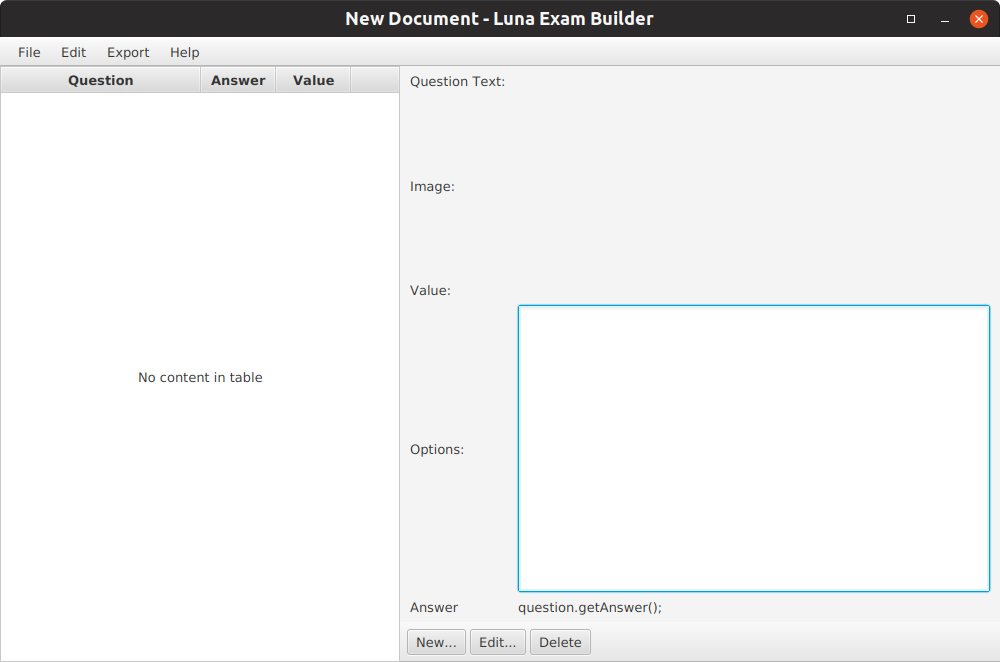
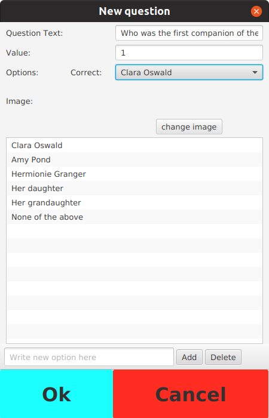
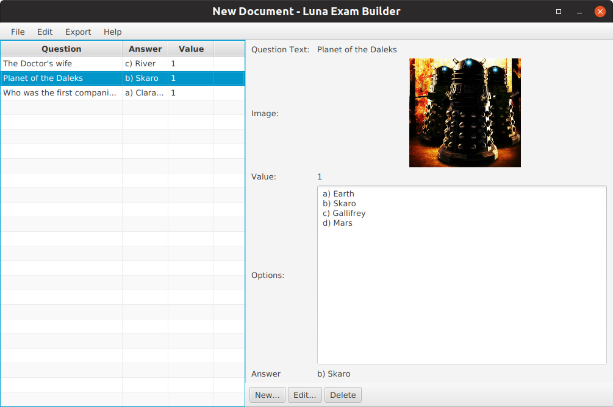
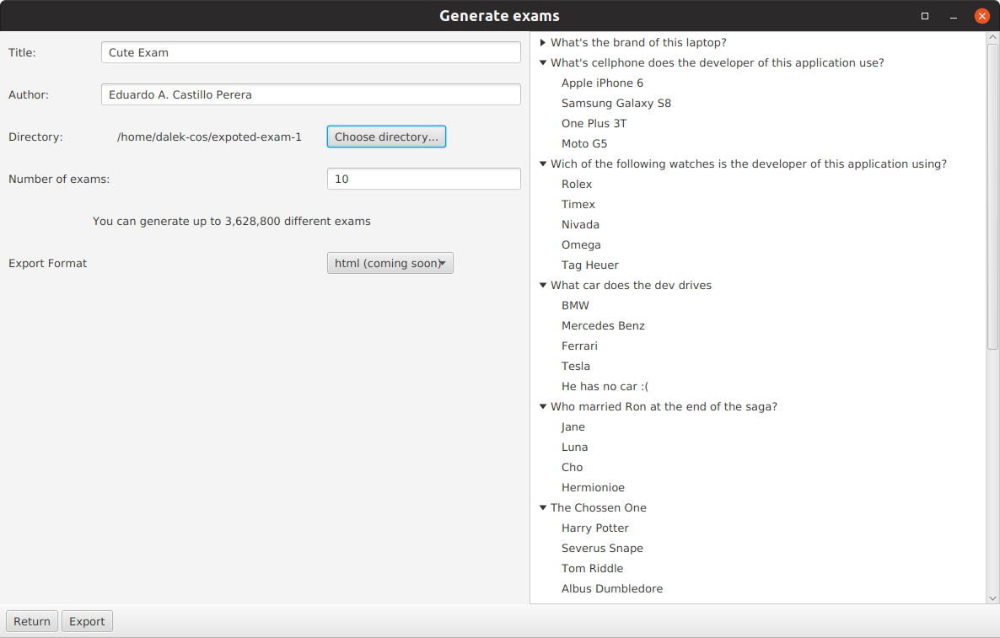
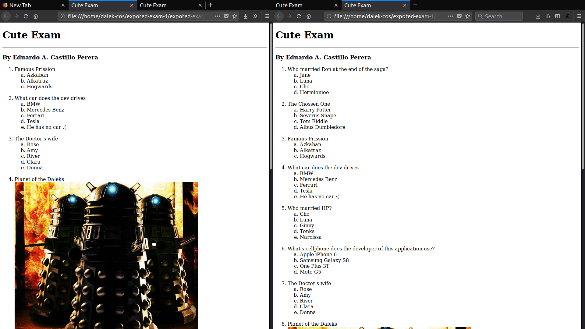

# Luna Exam Builder

This is an application designed to help teachers or every person in general to create multiple quizzes with just one click. It can randomly generate many versions of an exam by just entering the individual questions with its options. 

## History
The first version of this application was a class project for a contest when I was in High School back in May 2017. The application got me the first place. The first version was very simple and only printed the exams in the screen, and only allowed 4 choices per question. Then I decided to continue the project in my free time to help people who might like to use this tool. I continued to develop it until this day.

At this point, I think I could really finish it and have it working to its full capacity.

## Usage
When you start the application you will see an empty screen like this one:

You can start adding questions to the exam with the "new" button:

After a couple of aditions you might have this "beautifull" exam:

You can save the exam to an XML file and also you can export multiple versions to an HTML file so you can print it

This is how the HTML version looks like
